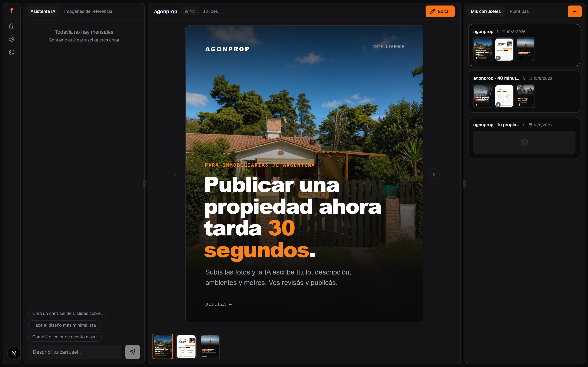
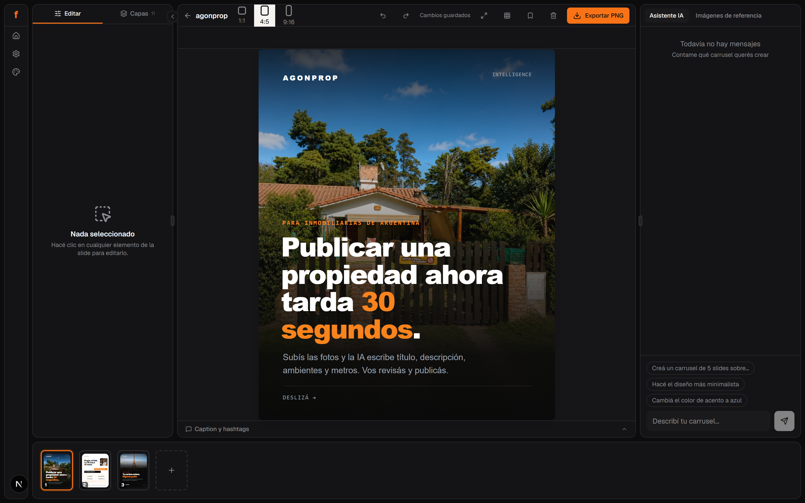
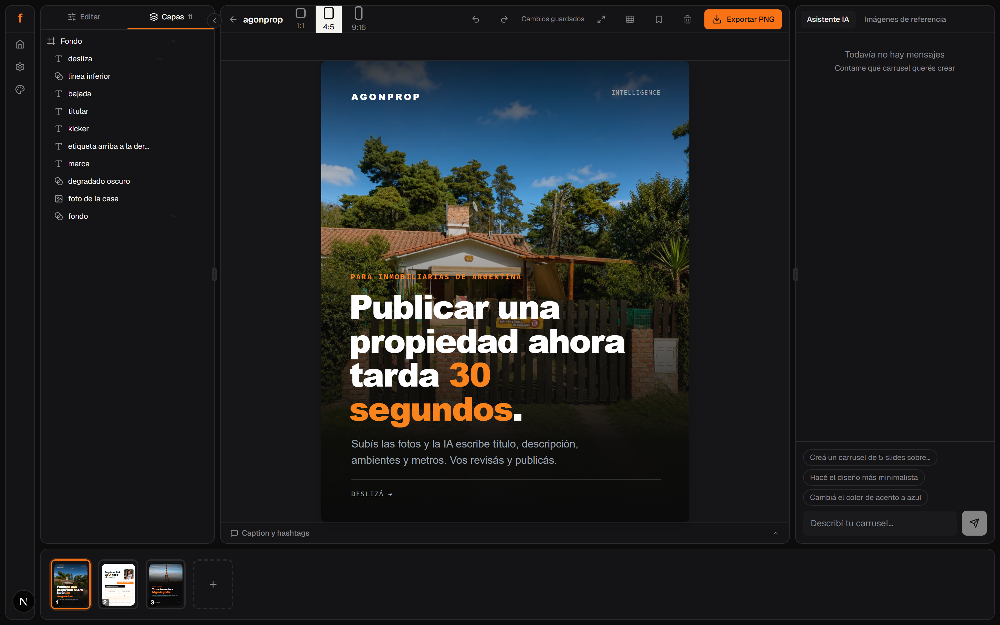

<div align="center">

# freecarrusel

### An AI design agent and a real layer editor, for Instagram carousels.

**Runs on your machine. Your files, your fonts, your brand. No account, no cloud, no lock-in.**

[](./LICENSE)
[](#-status)
[](https://nextjs.org)
[](https://react.dev)
[](https://www.typescriptlang.org)



</div>

---

## ⚠️ Status

<!-- update channel: verified -->

**freecarrusel is in active development.** It works end to end — you can go from a
prompt to exported PNGs today — but the API surface, the on-disk format and parts
of the editor still change between commits. Expect rough edges, and don't point it
at anything you can't afford to redo.

---

## What it is

Most carousel tools give you either a chat that spits out images you can't touch,
or an editor where you do all the work yourself. freecarrusel is both halves of
the job in one screen:

- **An agent that designs.** Give it a topic, a URL, or a photo. It plans the
  narrative, writes the copy, builds the slides, and applies your brand.
- **An editor that actually edits.** Every element the agent produced is a real
  layer: select it, drag it, resize it, restack it, recolour it, delete it. Text
  is editable character by character.
- **Both at once.** The chat sits next to the canvas. Select a headline, right
  click, "edit with AI", and ask for a change to that element alone.

Everything is stored as plain files in the repo folder: JSON for carousels,
PNG/JPG for images. No database, no account, nothing leaves your machine except
Google Fonts and the calls the AI agent makes on your behalf.

---

## Table of contents

- [Requirements](#requirements)
- [Install](#install)
- [First run](#first-run)
- [What it can do](#what-it-can-do)
  - [Creating with the agent](#creating-with-the-agent)
  - [Working from a URL](#working-from-a-url)
  - [The canvas editor](#the-canvas-editor)
  - [Layers](#layers)
  - [Text](#text)
  - [Images](#images)
  - [Fills, patterns and gradients](#fills-patterns-and-gradients)
  - [Your brand](#your-brand)
  - [Export](#export)
- [Updates](#updates)
- [How it works](#how-it-works)
- [Project layout](#project-layout)
- [Troubleshooting](#troubleshooting)
- [License](#license)

---

## Requirements

| | |
|---|---|
| **Node.js** | 20 or newer |
| **Claude Code CLI** | installed and signed in — this is what powers the agent |
| **OS** | Windows 10/11, macOS (Intel or Apple Silicon), Linux |
| **Disk** | ~1.5 GB — Puppeteer downloads its own Chromium for PNG export |

The app spawns the Claude Code CLI as a local subprocess and streams its output
into the chat. It is a hard dependency: without it the editor still works, but
the assistant panel stays disabled.

---

## Install

### 1. Install the Claude Code CLI

```bash
npm install -g @anthropic-ai/claude-code
```

Then sign in once, from any terminal:

```bash
claude
```

Follow the prompts, then type `/exit`. Your session is stored by the CLI itself —
freecarrusel never sees or stores your credentials.

> Full CLI documentation: <https://docs.anthropic.com/en/docs/claude-code>

### 2. Get freecarrusel

```bash
git clone https://github.com/mateotorrandell/freecarrusel.git
cd freecarrusel
npm install
```

`npm install` also downloads Chromium for Puppeteer and the native binaries for
image processing. It takes a few minutes the first time.

### 3. Point the app at the CLI

```bash
npm run setup
```

This finds the `claude` executable on your system and writes its path to
`.env.local`. It checks the usual places:

- **Windows** — `%APPDATA%\npm\claude.cmd`, `%LOCALAPPDATA%\Programs\claude\claude.exe`
- **macOS** — `/opt/homebrew/bin/claude` (Apple Silicon), `/usr/local/bin/claude`
  (Intel), `~/.local/bin/claude`
- **Linux** — `~/.local/bin/claude`, `/usr/local/bin/claude`

If it can't find it, run `where claude` (Windows) or `which claude` (macOS/Linux)
and put the result in `.env.local` yourself:

```
CLAUDE_CLI_PATH=/opt/homebrew/bin/claude
```

### 4. Start it

```bash
npm run dev
```

Open <http://localhost:3000>.

### Checking your setup

```bash
npm run doctor
```

Reports your Node version, whether the CLI was found, whether it responds, and
whether the data folders are writable.

---

## First run

1. Open the sidebar (the orange **f**) and go to **Mi marca / My brand**. Set your
   colours, your heading and body fonts, and upload your logo. The agent designs
   with these from then on.
2. Set your language in **Settings**. It governs the interface *and* the language
   the assistant writes in — replies, questions and the copy inside your slides.
3. In the chat on the home screen, describe what you want:

   > *"A 6-slide carousel about why most landing pages don't convert, editorial
   > style, dark background."*

   Slides appear one by one as the agent builds them. When it's done, click the
   carousel to open the editor.

---

## What it can do



### Creating with the agent

- **From a topic.** The agent plans a hook → problem → value → CTA arc, writes the
  copy and builds each slide through the API. It doesn't ask for permission first;
  it builds, then offers to adjust.
- **From your own images.** Drop photos in the **Reference images** tab of the
  chat. The agent opens each one, describes what it sees, and can either copy the
  style or place the photo directly into a slide.
- **On one element.** Right click anything on the canvas → **Edit with AI**. That
  element is attached to your next message, so "make this one green" changes only
  that block. The attachment can be cancelled before sending.
- **Caption and hashtags.** Generated on request and stored with the carousel.
- **Templates.** Save a finished carousel as a template and start the next one
  from it.

### Working from a URL

Paste a link and the agent mines it rather than skimming it:

1. Reads the rendered page *and* the raw HTML, because most sites are JS apps that
   return almost nothing to a plain fetch.
2. Finds the real logo — preferring an SVG wordmark or the header image over the
   favicon, which is usually a cropped monogram.
3. Downloads the actual photographs and uploads them into the project, so the PNG
   export (which renders offline) doesn't come out blank.
4. Extracts the palette and the fonts from the computed styles and saves them as
   your brand.
5. Builds one carousel per angle when you ask for several, instead of piling
   everything into one.

Brand extraction is a scored heuristic over the rendered page — it works on
arbitrary sites, not a hardcoded list. Sites that block headless browsers will
fail; it says so rather than inventing something.

### The canvas editor

The slide is a real document in a sandboxed iframe, and the editor manipulates it
directly:

- **Click** to select, **drag** to move, **eight handles** to resize. Resizing
  anchors the opposite edge — pull the right handle and the left edge stays put.
- **Right click** for copy, cut, paste, delete and *Edit with AI*.
- **Undo / redo** that survives a browser refresh: the history is mirrored to disk
  per slide, not kept in the tab.
- **Autosave** on a debounce, with a version check: if the agent rewrote the slide
  while your edit was still pending, your stale copy is rejected instead of
  silently undoing its work.
- **Safe zones** overlay for Instagram's crops, and a fullscreen preview.
- **Filmstrip** at the bottom: switch slides, drag to reorder, delete, or roll a
  single slide back a version.

### Layers



- The list reads **front to back** — the top row is what covers everything else.
- **Drag a row** onto another to restack it. Drop on the upper half to put it in
  front, the lower half to put it behind. An orange line shows where it lands.
- **Arrows** bring a layer forward or send it back one step.
- **Eye** hides a layer without deleting it. It stays in the list so you can bring
  it back.
- **Trash** deletes it.
- Layers are named in plain language by the agent — "dark gradient", "neighbourhood
  photo" — not CSS class names.

### Text

- **Double click** to edit in place; the caret lands where you clicked.
- **Drag across words** and the quick bar above the canvas formats *only that
  selection* — colour, size, bold, italic, underline. One block can hold several
  colours, the way a headline with one accent word should.
- Bold, italic and underline are **toggles**, and they light up for whatever is
  highlighted.
- The properties panel edits the **whole block**: font, size, weight, alignment,
  colour, background. The two never fight over the same click, and the toolbar
  tells you which one it's about to affect.
- The font list is Google Fonts; picking one loads it for the canvas and the
  export.

### Images

- Select an image layer and the panel shows the current photo, every image in the
  carousel, and an **upload** button — swap the file without touching markup.
- **Background removal** runs locally on your CPU. It's isolated in a child
  process, so a two-minute cutout doesn't freeze the app.
- Uploads are validated, re-encoded and stripped of EXIF. SVGs are rasterised on
  arrival and never served as SVG.

### Fills, patterns and gradients

The panel offers controls that match what the element actually is:

| Element | What you get |
|---|---|
| **Text** | font, size, weight, alignment, text colour, background |
| **Image** | swap the file, size, position, corner radius, opacity |
| **Pattern** (grid, stripes) | recolour the lines — the gaps stay transparent |
| **Gradient** (a wash over a photo) | recolour the hue, keeping every stop's alpha so the fade survives |
| **Shape / background layer** | flat colour, two-stop gradient with direction, or one of your photos |
| **Slide frame** | fill only — it holds every other layer, so fading it would fade the whole design |

Opacity is a 0–100 % slider on every layer, live while you drag, one undo step
when you let go.

### Your brand

One panel in the sidebar: name, five colours, heading and body font from Google
Fonts, logo, and style keywords. It is injected into the agent's instructions, so
every slide it designs starts from your identity instead of a generic template.

### Export

- **PNG per slide** at exact Instagram dimensions, delivered as a ZIP.
- Ratios: **1:1** (1080×1080), **4:5** (1080×1350) and **9:16** (1080×1920).
- Up to 10 slides per carousel.
- Export renders the same HTML the editor shows, through headless Chromium — what
  you see is what ships.

---

## How it works

```
Browser
  ├── chat  ──► POST /api/chat ──► Claude Code CLI (subprocess) ──► SSE stream back
  │                                      │
  │                                      └── curl ──► the app's own REST API
  ├── canvas ──► sandboxed iframe + postMessage bridge  (select / drag / style)
  └── panels ──► REST API ──► JSON files in /data
```

A few decisions worth knowing about:

- **The agent talks to the app over HTTP**, the same routes the UI uses. It has no
  direct access to the data files, so a bad instruction can't corrupt storage in a
  way the API wouldn't allow.
- **The canvas iframe runs with `allow-scripts` but without `allow-same-origin`.**
  It sits in an opaque origin: it cannot reach the parent page, cookies or
  storage. The only channel is `postMessage`, and every message is checked against
  the frame that sent it. Preview and export use `sandbox=""` — no scripts at all.
- **Slide HTML is sanitised** on the way in: scripts, event handlers,
  `javascript:` URLs and nested frames are stripped.
- **Writes are atomic** — temp file plus rename, behind a mutex — so a crash
  mid-save can't leave a half-written carousel.
- **The agent runs with an isolated config**, a neutral working directory and a
  spend cap, so it can't pick up unrelated settings from your machine.

---

## Project layout

```
src/
  app/
    api/              REST routes: carousels, slides, brand, upload, export, chat
    carousel/[id]/    the editor
    page.tsx          home: chat, preview, carousel list
  components/
    chat/             assistant panel and reference images
    editor/           canvas, layers, properties, filmstrip, export
    layout/           sidebar, resizable panels
    brand/            brand configuration
  lib/
    slide-editor-script.ts   the runtime injected into the canvas iframe
    slide-html.ts            the shared contract between preview and export
    chat-system-prompt.ts    what the agent is told about your brand and slides
    brand-extract.ts         palette, fonts and logo detection from any URL
    carousels.ts, data.ts    storage with per-slide version history
scripts/
  setup.mjs           locate the CLI, write .env.local
  doctor.mjs          environment diagnostics
  remove-bg.mjs       background removal, in its own process
data/                 your carousels (git-ignored)
public/uploads/       your images (git-ignored)
```

---

## Troubleshooting

**The assistant panel says the CLI isn't connected.**
Run `npm run doctor`. If it can't find `claude`, set `CLAUDE_CLI_PATH` in
`.env.local` to the full path and restart `npm run dev`.

**The agent replies in the wrong language.**
Language lives in Settings and is injected into the agent's instructions. Change
it there, not by asking the agent.

**Export produces blank images.**
Every image must live under `public/uploads` and be referenced as `/uploads/...`.
Remote URLs render blank because export runs offline.

**Windows: the dev server dies with a file-system error.**
A file literally named `nul` in the project folder will break the bundler — it's a
reserved device name. It usually comes from a shell script redirecting to `> nul`
instead of `> /dev/null`. Delete it (`del \\?\%CD%\nul`) and clear `.next`.

**Background removal times out.**
It's real CPU work and can take minutes on a large image. It runs in a separate
process, so the rest of the app stays responsive while it works.

---

## License

[MIT](./LICENSE) — use it, change it, ship it.
